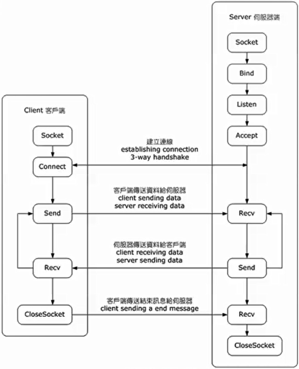

# socket流程

- socket()创建一个新的套接字并分配系统资源

- bind()一般用于服务端，将套接字与套接字地址（例如本地端口以及IP地址） 绑

- listen() 一般用于服务端，将绑定的TCP置于监听状态

- connect() 一般用于客户端，分配一个本地的空闲端口，并且与远程地址建立 连接

- accept() 一般用于服务端，接受一个新的连接请求，并创建一个与该链接绑定 的套接字

- send() 与 recv(), 或 write() 与read(), 或sendto() 与recvfrom()用于发送和接收数 据

- close() 关闭一个打开的套接字并释放资源

- gethostbyname() 与gethostbyaddr() 在IPv4协议中解析域名和地址

- select() 用于等待一个或多个指定套接字的下一个读写事件

- poll()用于测试一个或多个套接字的读写状态

- getsockopt() 得到指定套接字的参数

- setsockopt() 配置指定套接字的参数

流程图如下：

# Socket资料
1. [socket与socket lingering基础介绍](https://www.starduster.me/2019/07/06/socket-lingering-and-closing/)
2. [socket lingering进阶：测试与源码](http://www.4e00.com/blog/linux/2019/03/27/tcp-option-so-linger.html)
